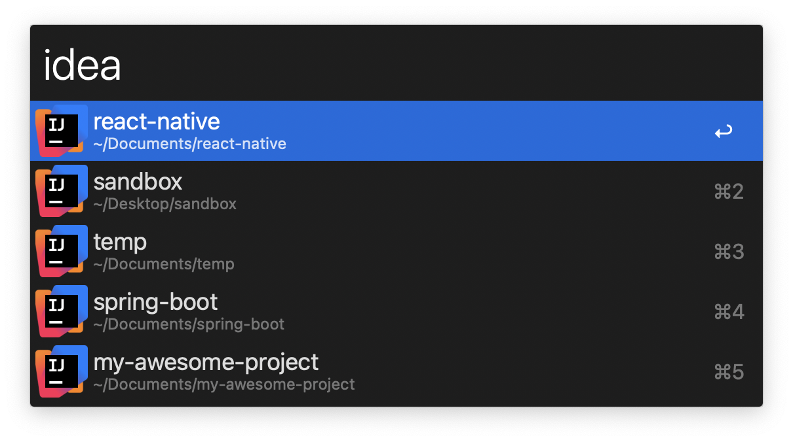
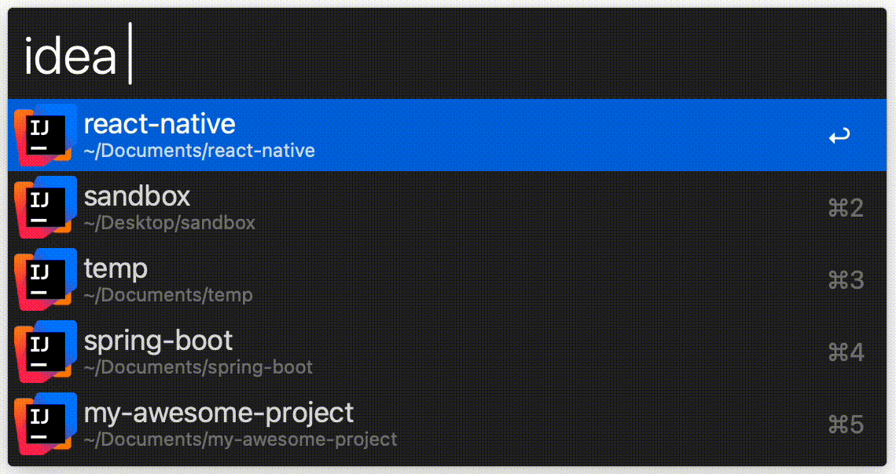

# JetBrains projects for Alfred


Alfred workflow for opening your JetBrains IDEs projects



## Supported IDEs

| IDE Name       | Version | Keyword       |
|----------------|---------|---------------|
| Android Studio | 4.1+    | androidstudio |
| AppCode        | 2020.3+ | appcode       |
| CLion          | 2020.3+ | clion         |
| DataGrip       | 2020.3+ | datagrip      |
| GoLand         | 2020.3+ | goland        |
| IntelliJ IDEA  | 2020.3+ | idea          |
| PyCharm        | 2020.3+ | pycharm       |
| RustRover      | 2024.1+ | rustrover     |
| WebStorm       | 2020.3+ | webstorm      |

Support for older IDE versions is not guaranteed.

## Getting started

### Prerequisites

Project requires Python 3.9+ to run, which is not included by default with macOS. You can install Python 3 using
this [guide](https://docs.python-guide.org/starting/install3/osx/).

### Installing

Download `*.alfredworkflow` file for your IDE from the latest release
at [Releases](https://github.com/artemy/alfred-jetbrains-projects/releases) page and open it with Alfred.

### How to Use

Open Alfred and type keyword for your IDE (see Supported IDEs above). Workflow will display list of recent projects (
sorted by time last opened descending).

You can further filter project list by typing additional words. Fuzzy first-letter search is supported (i.e.
typing `map` will find `my-awesome-project`):



## Running the tests

Make sure to first install test dependencies:

```shell
pip3 install -r requirements.txt
```

To run tests, execute

```shell
python3 -m recent_projects_test
```

If you want to get coverage figures through `coverage` tool:

```shell
coverage run -m unittest recent_projects_test # gather test data
coverage report -m # display coverage figures
```

## Built With

* [Python 3.9](https://docs.python.org/3.9/)
* [coverage.py](https://coverage.readthedocs.io/) - Code coverage measurement

## Contributing

Pull requests are welcome. For major changes, please open an issue first to discuss what you would like to change.

## License

This project is licensed under the MIT License - see the [LICENSE.md](LICENSE.md) file for details

## Acknowledgments

See [CONTRIBUTORS.md](CONTRIBUTORS.md)
and [contributors](https://github.com/artemy/alfred-jetbrains-projects/contributors) for the list of contributors.
